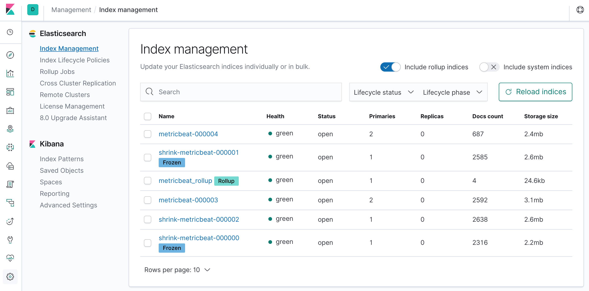

# Scale Your Elasticsearch Cluster

Demo code for the [Scale Your Elasticsearch Cluster](https://speakerdeck.com/xeraa/scale-your-elasticsearch-cluster) talk.

**The settings used here are for a short lived demo only. Do not use those for any development or production environments.**


## Features



Start with a `docker-compose up` and explain the different parts while it is initializing.


### Index Lifecycle Management

Explain how `node.attr.size` is tying the architecture together. Show both *setup/templace_metricbeat.json* and *setup/ilm.json*, explain what is going on, and show the results in Index Management. Also load the ILM configuration in the Kibana UI, but explain why not all values are shown correctly.


### Frozen Index

Trying out frozen indices including the recommended steps to use:

```bash
PUT frozen
{
  "settings": {
    "index.routing.allocation.include.size": "cold",
    "index.number_of_replicas" : 0
  }
}

POST frozen/_doc
{
  "name": "Philipp"
}
POST frozen/_doc
{
  "name": "Nicolas"
}

GET frozen/_search

POST frozen/_forcemerge?max_num_segments=1

POST frozen/_freeze

GET frozen/_search

GET frozen/_search?ignore_throttled=false

GET _cat/indices/frozen?v&h=health,status,index,pri,rep,docs.count,store.size

GET _cat/thread_pool/search_throttled?v&h=node_name,name,active,rejected,queue,completed&s=node_name

GET frozen/_search?ignore_throttled=false&pre_filter_shard_size=1

POST frozen/_doc
{
  "name": "Abdon"
}

GET frozen/_settings?flat_settings=true

POST frozen/_unfreeze

POST frozen/_doc
{
  "name": "Abdon"
}

GET frozen/_search
```

Show in *Discover* how the frozen indices are not shown by default and that you need to turn them on in the Kibana settings.


### Rollup

Show the underlying *setup/rollup.json* and how you would build it in the Kibana UI. Show the underlying documents in Discover and build a visualization on the Docker network traffic.


### Cleanup

Run `docker-compose down -v` to get rid of the entire setup again.
